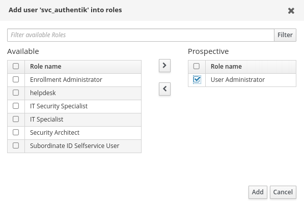
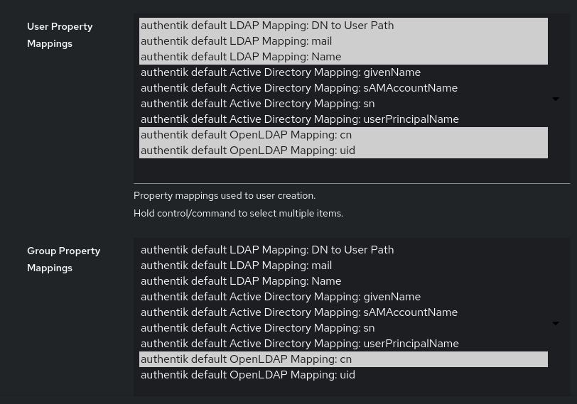

# Virtual ORFEO with OFED and Ceph
> *Everybody has a testing environment. Some people are lucky enough to have a totally separate environment to run production in.*

## STEP 0: Initial requirements

Use a **Fedora 40** system, as later versoions require additional steps and different distros require different package names and/or additional steps. You can try and adapt the steps to other systems, but it will require some extra work.    

Experimentally, we have determined that the minimum hardware required to follow this tutorial are:

* At least **4 physical cores** (we tried running on a 2 core hyperthreaded system and it didn't work)
* At least **32 GB of RAM** (we tried on a system with 24 GB, it could run everything but *NOMAD Oasis*)
* While not strictly required, an **SSD** (any kind: SATA, PCIe Gen 2, 3, 4, whatever) is ***VERY*** recommended.

This tutorial is an expanded version of [Isac Pasianotto's tutorial](https://gitlab.com/IsacPasianotto/testing-env-doc).

## CLONE THE REQUIRED REPOS

For this to work, we will need the repos for [Virtual ORFEO](https://gitlab.com/area7/datacenter/codes/virtualorfeo), [the one specific for the kubernetes overlay](https://gitlab.com/area7/datacenter/codes/orfeokuboverlay) and [the one we made for Ceph](https://gitlab.com/dododevs/units-infra-final).  

Download them using `SSH`:  
```
git clone git@gitlab.com:area7/datacenter/codes/virtualorfeo.git
```

```
git clone git@gitlab.com:area7/datacenter/codes/orfeokuboverlay.git
```

```
git clone git@gitlab.com:dododevs/units-infra-final.git
```  

we will need a specific branch for `orfeokuboverlay`, so run:  

 ```
 cd orfeokuboverlay/
 git checkout hotfixes/authentik
 ```

## INTIAL SETUP

### Install the Requirements

Move into `virtualorfeo` and run:

```
git submodule init && git submodule update --remote
sudo dnf install -y $(sed -r '/^#/d' requirements.txt)
```

Then install other packages that will be required but might not have already been installed:  

* the Python version of *Kubernetes*, the *jq* package:

```
sudo dnf -y install jq python3-kubernetes
```

* You should already have `kubectl` installed, but let's also install the `kustomize` command independently (required by one of the *playbooks* for *MinIO*)

```
curl -s "https://raw.githubusercontent.com/kubernetes-sigs/kustomize/master/hack/install_kustomize.sh"  | bash
sudo mv kustomize /usr/local/bin/
```

* Install *Jetstack* (required by a *kuboverlay* *playbook*):

```
helm repo add jetstack https://charts.jetstack.io
helm repo update
```

* *(OPTIONAL)* Install *Chromium*, which works better for certificates and proxies:

```
sudo dnf install chromium
```

### Install the Required Plugins

The tested provider for *vagrant* is *libvirt*, hence install the *vagrant* plugin for it, enable the services and add your user to the *libvirt* group.

```
vagrant plugin install vagrant-libvirt
sudo systemctl enable --now libvirtd
sudo usermod -aG libvirt $(whoami)
```

Now, to apply the command *usermod* you need to log out and back in again. If you're running locally, you can reboot the system to make sure; otherwise, you can just use `su - $(whoami)` to login again in the current *bash*.  

To check if the settings applied correctly, run `groups`. If you see *libvirt* listed, you're good to go.

### Export Global Variables

We will need some variables to be defined globally.  

First of all, we need to indicate where to find the configuration file for kubernetes.  

If you don't have any more clusters, you can edit the *.bashrc* to include these, otherwise you probably already know how to operate:

```
export KUBECONFIG=<path-to-your-project-folder>/virtualorfeo/playbooks/kube_config
```

Then we add a variable to find the *orfeokuboverlay* directory:

```
export ROOTPROJECTDIR=<path-to-your-project-folder>/orfeokuboverlay
```

Add both (or just the second) to the *.bashrc*.

## BRING UP THE FIRST COMPONENTS

We will now run a limited version of the infrastracture to perform the setup for *OFED*.  

### Run the First Playbook

Move into the right directory:

```
cd <path-to-your-project-folder>/virtualorfeo/playbooks
```

and apply/install the required *ansible* settings:

```
ansible-galaxy install --role-file roles/requirements.yml --force
```

After that is done, run the first *playbook* in a limited capacity by selecting only the commands tagged with _kub_:

```
ansible-playbook 00_main.yml --tags kub
```

This is to ensure only the strictlynecessary commands are run, so that we can first enlarge the VM where *kubernetes* is running to fit everything.  

### SIMPLE PROXY (optional)

Placeholder for the *simple proxy* part. Required if running remotely via `SSH`.

### Enlarge the VM's Storage

Now, to make all the required pods and services fit in the `Kubernetes` VM, we need to enlarge it.  

First of all, let's get the ID of the *kube01*  VM:

```
vagrant global-status
```

stop it

```
vagrant halt <kube01-id>
```

then modify the image by adding 5 GB

```
sudo qemu-img resize /var/lib/libvirt/images/k3s_nodes_kube01.img +5G
```

Now let's turn the machine back up again:

```
vagrant up <kube01-id>
```

then log into it as `root`:

```
ssh root@192.168.132.10
```

and run the following command:

```
cfdisk /dev/vda
```

use the &uarr; &darr; of your keyboard to navigate to `/dev/vda4`, then use the &larr; &rarr; to select `Resize`, press `Enter` to confirm the new fisk size; then selectr `Write`, confirm writing `yes` and `Enter`, then `Enter` again to `Quit`.  

Now expand the `root` partition by running

```
sudo btrfs filesystem resize max /
```

and then

```
df -h
```

to check if the edit took.

### Add the Hostnames for some of the VMs

> **NOTE** : check later if other addresses need to be addressed

Edit the *hosts* file to add hostnames:

```
echo "192.168.132.70 ipa01.virtualorfeo.it" | sudo tee -a /etc/hosts > /dev/null
echo "192.168.132.100 auth.k3s.virtualorfeo.it" | sudo tee -a /etc/hosts > /dev/null
echo "192.168.132.100 minio.k3s.virtualorfeo.it" | sudo tee -a /etc/hosts > /dev/null
```

### Export the Certificates from IPA

Moreover, even if is not strictly necessary, to avoid the browser warning due to the `unknown CA`, it is recommended to add the *IPA CA* to the `system trusted CA`.  

Export the certificates from the *IPA* VM:

```
scp root@ipa01.virtualorfeo.it:/etc/ipa/ca.crt /tmp/freeipa-virtorfeo.crt
```

then move it to the list of `ca-trusted` sources:

```
sudo mv /tmp/freeipa-virtorfeo.crt /etc/pki/ca-trust/source/anchors/freeipa-virtorfeo.crt
```

Then update the list:

```
sudo update-ca-trust
```

### **[OPTIONAL]** Install k9s

`k9s` is a very useful GUI interface to monitor and manage the pods running in *kubernetes*. 

Add the required repo and install it like so:

```
sudo dnf -y copr enable luminoso/k9s
sudo dnf -y install k9s
```

then run it in a separate terminal by running the command `k9s`; press `Enter` to connect, then press `0` on the keyboard to show all of the *namespaces*. 

### Deploy the Cert-Mananger

Enter into the *playbook* directory:

```
cd $ROOTPROJECTDIR/playbooks
```

then let's run the first two *playbooks*.  
The first one enables the *ACME* challenge

```
ansible-playbook 01_ipa_acme_enable.yml
```

then the second one handles the certifications through `kubernetes` and the `IPA` server.  

In order to work, `cert-manager` requires a valid issuer. Since all the setup is a testing environment, with a private DNS and CA (IPA), The IPA node is used as `ClusterIssuer`:

```
kubectl apply -f $ROOTPROJECTDIR/00-cert-manager/environment/dev/clusterIssuer/k3s.virtualorfeo.it.yaml
```

### Install Authentik

The installation of *authentik* is done using *helm*:

```
cd $ROOTPROJECTDIR/20-authentik
```
then add the repo
```
helm repo add authentik https://charts.goauthentik.io
helm repo update
```

and finally install it with the appropriate settings:

```
helm install auth authentik/authentik \
  --version 2024.4.2 \
  --namespace authentik \
  --create-namespace \
  -f values.yaml \
  -f environments/dev/values.yaml
  ```

## SET UP *IPA* AS USER-SOURCE FOR *Authentik*

Technically, *authentik* is able to define users and group directly in its database, but in this way those users will exists only in the *authentik* database. To avoid this, it is possible to use an external user-source, in this case, the *IPA* server relying of *LDAP*.

### Create Bind Account

> **NOTE**: add instructions on how to open Chromium using the proxy when accessing the machine remotely. 

Start *Chromium* (or whatever browser you want) and navigate to `ipa01.virtualorfeo.it`. Login with the admin credentials:

* username: `admin`
* password: `12345678`

Click on `Identity` &rarr; `Users` &rarr; `+Add`and register an `svc_authentik` user which will be used by *authentik* to bind to the *LDAP* server.


 > <span style="color:red;"> !!! WARNING !!! </span> during the user creation, `freeIPA` does not require to set a password, however *authentik* will need it to bind to the *LDAP* server. Remeber to set a password (in a test environment like this also a simple one as `12345678` is fine). Remember to fill it out even for future users.
 
 > <span style="color:red">  !!! WARNING !!! </span> now it's unimportant, but you can set the `$HOME` and `shell` of the user from here.

 Once you filled the form up, click on `Add and Edit` button.  
At this point go to the `Roles` settings tab and assign to the user the `User Administrators` roles clicking on the `Add` button:



### Authentik First Setup

Before configuring the *LDAP* source in *authentik*, it is needed perform the fist access and create an admin user. To do that open a web browser and go to `auth.k3s.virtualorfeo.it/if/flow/initial-setup/` (be mindful, the final `/` is vital. It could be automatically removed by your borwser; in that case, you will land on the wrong page. Just add it back and you should be good to go).  

Then enter an email (e.g. `admin@virtualorfeo.it`) and a password (eg `12345678`) and click on the `Create` button.  
 
This will setup the credentials for the *Authentik*’s default administrator `akadmin`.

### Configure an *LDAP* source in *authentik*

* Click on `Admin interface` &rarr; `Directory` &rarr; `Federation and Social Login` &rarr; `Create`.  
* Select *LDAP* source and click on `Next`.
* Set up with the following  values:  
    1. On the *main* section:

        * **Name**: `freeipa`
        * **Slug**: `freeipa`
        * Leave **enabled** the `Enabled`, `Sync Users`, `Sync Groups` and `Use Password writeback` options

    

    2. In the *Connection Settings* section:

        * **Server URI**: `ldaps://ipa01.virtualorfeo.it`
        * **Disable** the toggle for `Enable StartTLS`
        * **Bind CN**:` uid=svc_authentik,cn=users,cn=accounts,dc=virtualorfeo,dc=it`
        * **Bind Password**: `12345678` (or the password you set to the svc_authentik user in the previous step)
        * **Base DN**: `dc=virtualorfeo,dc=it`
    
    

    3. In *LDAP Attribute Mapping* section:

        * In **User Property Mappings** Select (multiple selection using `ctlr`):

            * Authentik default LDAP Mapping: DN to User Path
            *Authentik default LDAP Mapping: mail
            * Authentik default LDAP Mapping: Name
            * authentik default OpenLDAP Mapping: cn
            * authentik default OpenLDAP Mapping: uid
        
        * In the **Group Property Mappings** Select: `authentik default OpenLDAP Mapping: cn`

    

    4. In the `Additional Setting`:

        * **Addition User DN**: `cn=users,cn=accounts`
        * **Addition Group DN**: `cn=users,cn=accounts`
        * **User Object Filter**: `(objectClass=person)`
        * **Group Object Filter**: `(objectClass=groupofnames)`
        * **Group membership field**: `member`
        * **Object uniqueness field**: `ipaUniqueID`

    

    5. Click on the `Save` button, then click on the `freeipa` name, then on the `Run syng` button. It won't automatically update, so you have to either refresh the paege or navigate in and out of the page to see if it updated. It will display errors, do not worry.