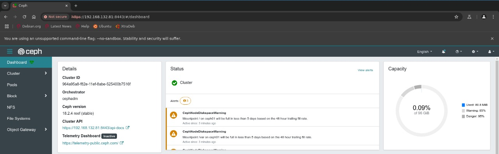
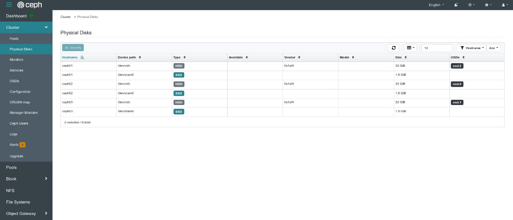
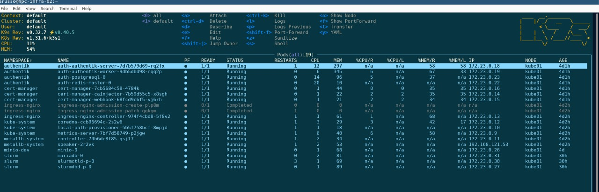
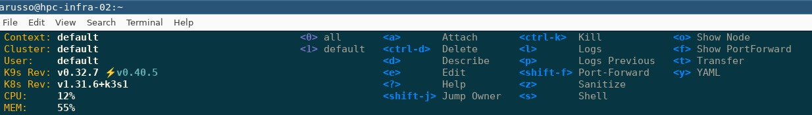
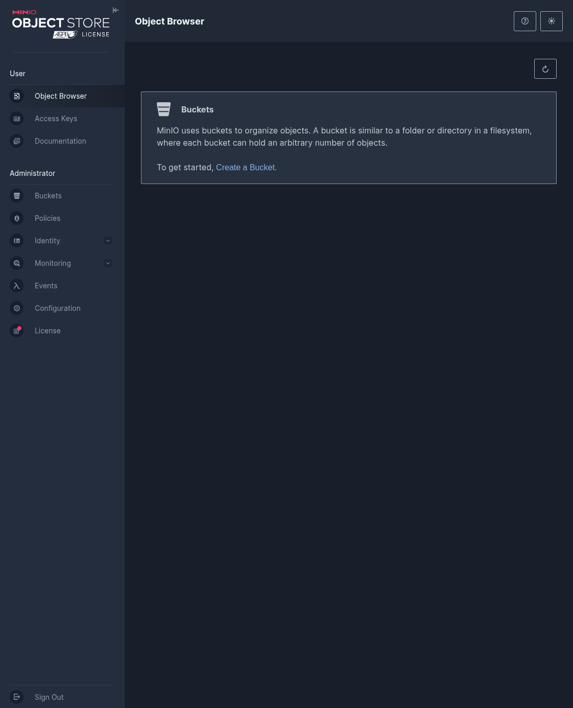
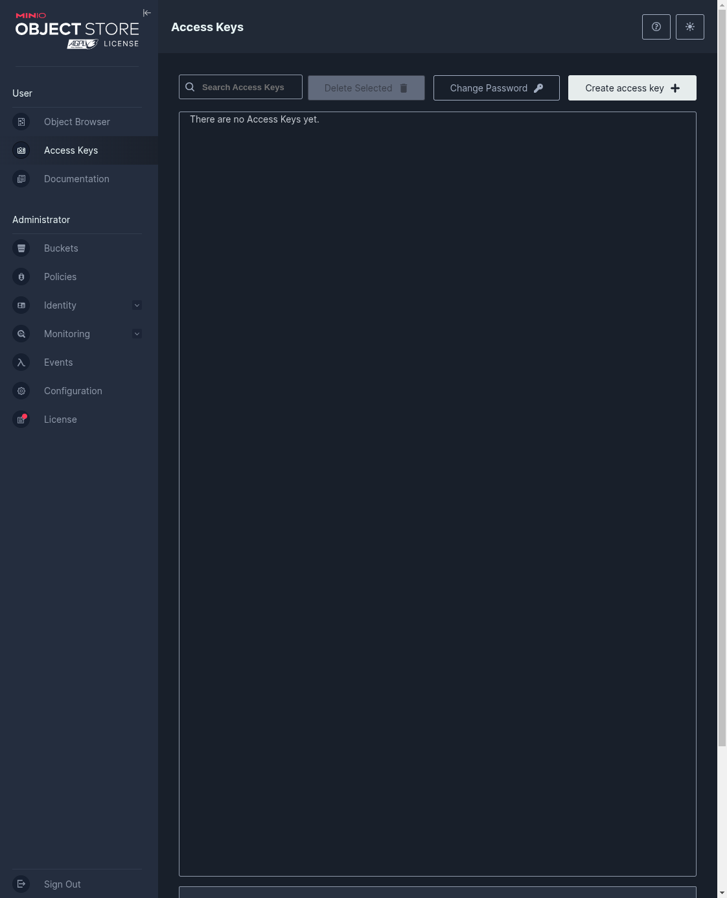
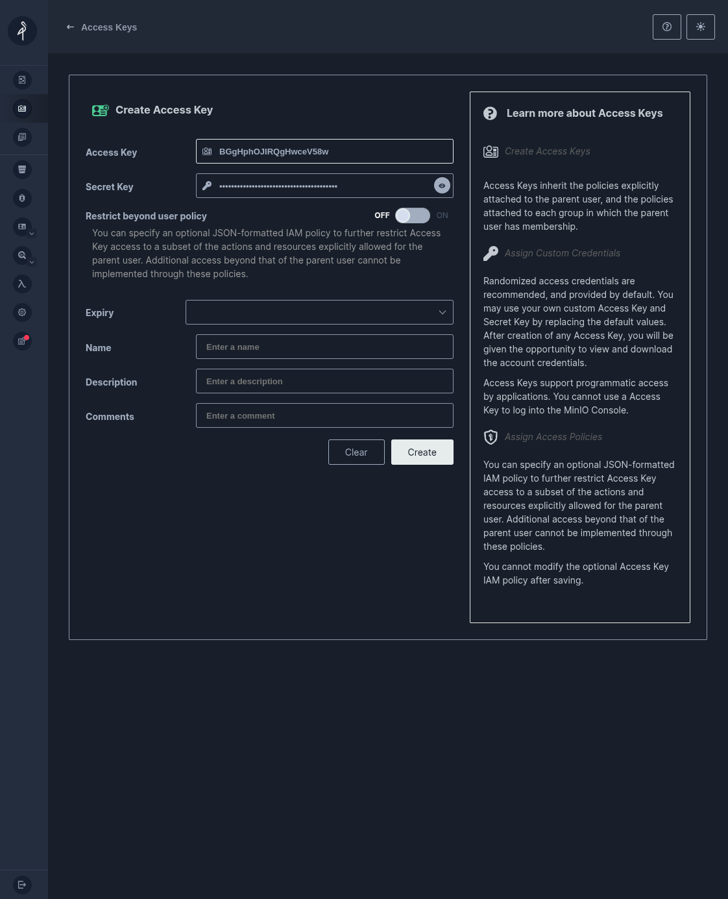
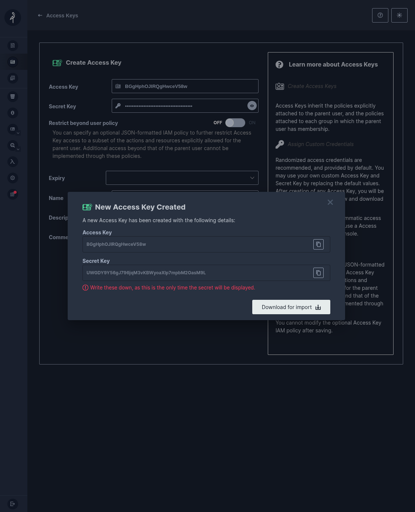
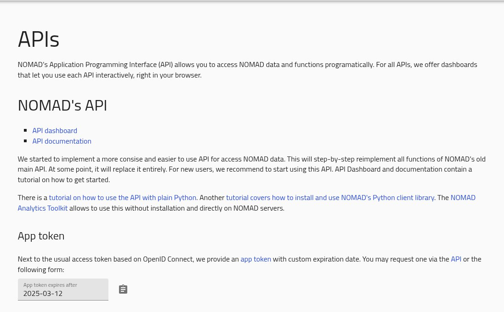
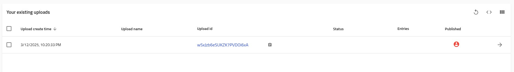

## Tasks


After referring to the [this quick-start guide](https://github.com/robonoff/HPC-DATA-INFRASTRUCTURE-2024-2025/blob/editing-rob/setup.md) to deploy a working testing infrastructure as starting point, it's time to implement all the tasks described below.

### HPC-infrastructure assignments

#### 1. Implement Distributed Storage with Ceph
The first task is to set up a **Ceph**-based distributed storage system within Virtual Orfeo, mirroring the approach used in the production environment. The main steps include:

---

1. **VM Planning**
   We have defined an  **odd number** of VMs to ensure high availability in a Ceph cluster (e.g., 3 or 5).
   The odd number is required due to a quorum-based election mechanism.
   Using three or more nodes in a storage infrastructure also provides several compelling advantages. Enhanced high availability or fault tolerance ensures applications continue running even in the event of two nodes going down.

2. **Add Storage**
   Attach additional storage disks to these VMs to serve as **OSD**.

3. **Deploy a Ceph Cluster**
   Install and configure Ceph across the VMs.

4. **Create a Replicated Pool and File System**
   Once the cluster is up, create a replicated pool and then set up a Ceph file system.

5. **Mount the File System**
   Mount the Ceph file system on all nodes (e.g., at `/orfeo/cephfs/scratch`).

---

All of these tasks have been automated through the **Ansible** playbooks. 
After you have followed the first tutorial [setup](https://github.com/robonoff/HPC-DATA-INFRASTRUCTURE-2024-2025/blob/editing-rob/setup.md), navigate to:

```
cd units-infra-final/01_ceph/playbooks
```

To bring up all the ceph nodes (needed to simulate the storage nodes), run in your terminal the following command:


```
ansible-playbook 00_all.yml
```

With this `.yml`, you'll bring up three ceph nodes (`ceph01`, `ceph02` and `ceph03`). 
Now, it's necessary to connect our ceph nodes to the virtual environment through:

```
ansible-playbook 05_mount.yml
```

This is done to automate all the steps available at this [tutorial](https://github.com/Foundations-of-HPC/HPC-and-DATA-Infrastructure-2024/blob/main/tutorials/ceph/ceph-deploy.md).

After you have runned all of the playbooks, open this address on chromium (the browser previously used during the setup): `https://192.168.132.81:8443/`. It should appear a dashboard like this:




On the ceph dashboard, it's possible to inspect all the details implemented through the ansible playbooks. Navigate to *pools* to check if they have been created.
Same is for *OSDs*: navigate to `Cluster` &rarr; `OSDs` through the GUI.
Also, check if the `Cluster` &rarr; `Physical disks` if everything has worked.




---

#### 2. Enhance Slurm Configuration
As the current Slurm configuration on our virtual machine is minimal and simply queues jobs in submission order,
it's necessary to modify this configuration to resemble a production-like environment by introducing **Quality of Service (QOS)** rules. Specifically:

- **Implement a Debug QOS**: Create a high-priority QOS (for example, `zebra`) that allows short, resource-light jobs to run with high priority regardless of submission order.

  For instance, if jobs `job1`, `job2`, `job3` were submitted, followed by a debug job `dbg1` (with `--qos=zebra`), the debug job should preempt or be scheduled before the other queued jobs, provided it meets the debug QOS criteria (e.g., minimal resources and short runtime).


To implement to QoS, the documentations we took inspiration from are the following: [Slurm Quality of Service](https://slurm.schedmd.com/qos.html), [sacctmgr from Slurm](https://slurm.schedmd.com/sacctmgr.html), [sacctmgr tips JHPCE](https://jhpce.jhu.edu/slurm/tips-sacctmgr/).


The first step is to modify the Slurm configuration by:
- Editing files directly in the **`slurmctld`** pod, or
- Updating the **`slurm-conf`** ConfigMap in the Kubernetes cluster.

In order to do so, let's start inspecting the cluster: use **`k9s`** to browse the pods and ConfigMaps.
The first step to perform from the terminal of your main machine, open k9s in this simple way:

```
k9s
```

after that, a GUI will open. This is what you will see




On the top of the GUI, you can find lots of ways you can interact with pods through k9s.
Through the &uarr; &darr; of your keyboard, it's possible to select the pod you wanna interact with. In our case, at this step, we want to interact with **slurmctld**, which is the pod for scheduling the various jobs.





After selecting the desired pod, for example you can click on <d> on the keyboard and an entire description of the pod features will appear. 
In our specific case, right now, what it's required to do is to open the shell. To do so, click the *s* letter on the keyboard.
At this point, you will be in **root@slurmctld-p-0**. 
Run this command:

```
vi etc/slurm/slurm.conf
```

We need to modify the priorityweightqos as follows:

```
priorityweightqos=10000
```

After you have modified the slurm.conf, save and exit k9s.
Note that the editor is vi. This is the way to modify: press `i` to enter *insertion* mode,  then press `Esc`, write `:wq` to write the file to save it and then quit the editor and then `Enter`.  
This step is **important** as it makes modifications consistent whenever we switch off the virtual machine from which we are working.

Log out, now login as `root` in `login01`

```bash
ssh root@login01
```

and again run this command to apply the change

```bash
scontrol reconfigure
```
---

### CREATE USERS AND QoS


Create the account (it's basically the group the users are part of) with:

``` 
sacctmgr add account <randomname> cluster=orfeo Priority=1000
```

To create the users: 

```
sacctmgr add user user01 cluster=orfeo Partition=p1,p2,debug Account=<randomname>
```

To check if the user01 is associatied with the right account and the desired partition

```
sacctmgr list association
```

For setting a QoS:

```
sacctmgr add qos zebra
```

For setting the priority or other limits [check documentation](https://slurm.schedmd.com/qos.html):


```
sacctmgr modify qos zebra set MaxWall=00:01:00 priority=10000
```

--- 
## To add QoS to a user

```
sacctmgr modify user user01 set qos=zebra
```

It's possible to associate an user to multiple QoS:

```
sacctmgr modify user user01 set qos+=alligator
```

Now to test whether it worked or not, we need to run 3 jobs using any of the configured normal users. To do so, we need a `job` file to `sbatch` with different options in such a way to create a queue, and check whether the job with the higher priority gets started before the one with the lower priority.  

Here's the most basic file to do so, a `job` that just waits for 60 seconds.

```bash
nano test.sh
```

```bash
#!/bin/bash

#SBATCH --account=default
#SBATCH --error=error_%j.log

sleep 60

```
Close and save. We use nano, but any text editor is fine.


```bash
chmod +x test.sh
```

now let's sbatch it twice specifying the normal *QoS*:

```bash
sbatch -p p1 --qos=normal --job_name=normal_0 test.sh
```

```bash
sbatch -p p1 --qos=normal --job_name=normal_1 test.sh
```

and then sbatch it with the higher priority *QoS*

```bash
sbatch -p p1 --qos=debug --job_name=debug test.sh
```

now run `squeue` to see the queue, what's in it and what's being run. Either you can cancel the running job with`scancel <job-id>`, then run `squeue` again and check if the `debug` job is being run ahead of `normal_1`, or you can just wait and run `watch squeue` and see what happens.  

---

# Data-infrastructure tasks

### Deploying MINIO and testing the OFED Environment

In this section, we continue the deployment, and we test the OFED virtual environment, which includes MinIO and Authentik.
The testing process involves verifying that Authentik and MinIO work correctly, with **both*** a **graphical** login and **API-based access**, utilizing credentials managed by Authentik.


## Running *MinIO* with the *API* client `mc`

It is possible to run *MinIO* from command line or using a script, for example a *Python* one, using the appropriate *API*. To do so, one needs to install the proper packages, libraries and follow the right set up steps.  

### Get the secret key

First of all, let's generate the `access key`. To do so, navigate to [https://minio.k3s.virtualorfeo.it/](https://minio.k3s.virtualorfeo.it/), login using the admin credentials for *Authentik* and go to the `Access Keys` section.



Then click on `Create access key` button



click on the `Create` button



which will open an interface with the key and a button to download the *json* containing the keys. Do so, as this will be the last time they will be shown and using the file is more useful than having them written somewhere.  



Now if you are using a remote machine/VM via proxy, you should note that the file should have been saved on your local machine. Upload the file using `scp` to the remote machine (assuming you downloaded in `Downloads/`)

```bash
scp $HOME/Download/credentials.json <shortcut-to-your-remote>:<path-to-your-project-directory>
```

### Install the `mc` client

Now, we need to install the packages required to run the *API* calls for *MinIO* from the CLI. You can find the complete documentation [here](https://min.io/docs/minio/linux/reference/minio-mc.html).  

Install it by downloading the binaries then moving them to the appropriate location:

```bash
curl https://dl.min.io/client/mc/release/linux-amd64/mc \
  --create-dirs \
  -o $HOME/minio-binaries/mc \
cd $HOME/minio-binaries \
chmod +x mc
```

```bash
sudo cp mc /usr/bin
```

Test it by running

```bash
mc --version
```

If everything is fine, proceed.

> NOTE: the system might offer to install the package for you. DO NOT ACCEPT. That is a different command also called `mc` which has nothing to do with this.

### Create the *alias*

Get the access and secret keys from the `credentials.json` and paste them in a `.env` file like so:

```bash
nano .env
```

```bash
minio_access_key=fhcMdSrkR1OVWbP8MzaL
minio_secret_key=7xEhk6FZBAcYbUmw30w2v2OU9eZ6D36rekzerX99
```

then add this line to to the `.bashrc` export them as variables in every new shell

```bash
export $(cat /path/to/your/.env | xargs)
```

then either log out and back in, close the terminal and open a new one or run `source .bashrc`.  

Now you can actually create the alias to use for the *API* calls by running:

```bash
mc alias set <alias> https://s3.k3s.virtualorfeo.it $minio_access_key  $minio_secret_key
```

if you see an output like

```bash
Added `<alias>` successfully.
```

### Create the *bucket*

The command to create a bucket is the following:

```bash
mc mb <alias>/<bucket-name>
```

In anycase, the python script does a check if there is an existing one or not. In case there is none, it will create one, so you might skip this step. 

### Using the *API* to make calls

The documentation provided explains from this point onwards how to make calls to create buckets (basically the equivalent of directories), upload, edit, list or download files, etc.  

For testing purposes, you can also use them via a *Python* script - one example is provided in the [*scripts*](scripts/) directory of this repo.


# Deploy Nomad Oasis 

## 4. File Syncronization
### Install *NOMAD*
Nomad Oasis is a data management platform that allows users to store and share files.
Since It has its own storage system, it is necessary to synchronize MinIO storage with the Nomad Oasis database.
Our main task here is to implement a synchronization procedure (through a script) that allows to download a file from MinIO and upload it to Nomad Oasis and vice versa.

The first thing to do is to install docker, and then Nomad. 
Please, follow this documentation. When using docker, note to use sudo.

1. [Install Docker](https://docs.docker.com/engine/install/fedora/)

2. After installing Docker, add the user to the group:

```
sudo usermod -aG docker $USER
```

2. [Install Nomad Oasis](https://github.com/FAIRmat-NFDI/nomad-distro-template?tab=readme-ov-file#deploying-the-distribution)


Once you have the entire setup ready, it's time to extract a token from nomad. Go on nomad through chromium or the preferred browser and type `http://192.168.132.1/nomad-oasis/gui/` or `http://localhost/nomad-oasis/` (they are equivalent). 
Something like this should show up:


Register an account through the **LOGIN/REGISTER** findable on the top right of the page. 
After you have registered through an e-mail and you are logged in, on the top bar click on `Analyze` &rarr; `API's`





Click on the date (put a date further ahead, as you are setting an expiry date to the token), and then click on the :clipboard: icon to copy the token. 
From the vm terminal, open the `.env` where the `$minio_access_key` and the `$minio_secret_key` have been previously saved, and add:


```
minio_access_key=<AccessKey>
minio_secret_key=<SecretKey>
nomad_token=<TOKEN>
minio_url=https://s3.k3s.virtualorfeo.it


```

Close, save, and then run from the terminal:

```
export $(cat .env | xargs)
```

Now that we have saved our environment variable, run this command from the terminal to get the authorization from nomad. 

```
curl -X 'GET' "http://localhost/nomad-oasis/api/v1/uploads" -H 'Authorization: Bearer <TOKEN>'
```

After this step, download the scripts, and move them into the <path-to-your-home>/units-infra-final/04_nomad, which is part of the one the repos cloned at the beginning. 

```
cd <path-to-your-home>/units-infra-final/04_nomad
```

```
./sync_all.sh
```


To check if everything has worked fine, go to Minio and check the bucket, as we have seen previosly.
As it regards Nomad, on the top bar go to `Publish` &rarr; `Uploads`.





